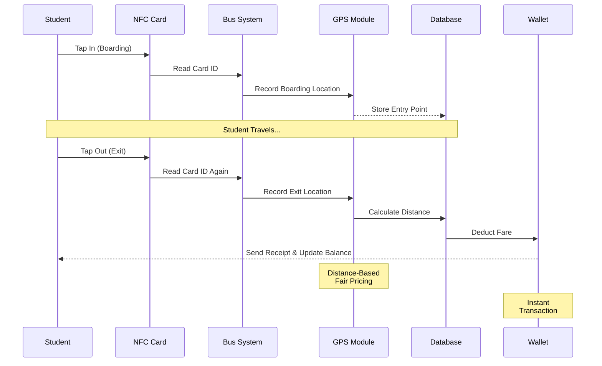
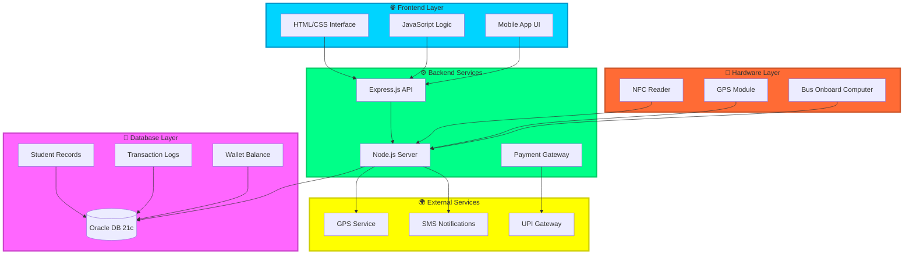
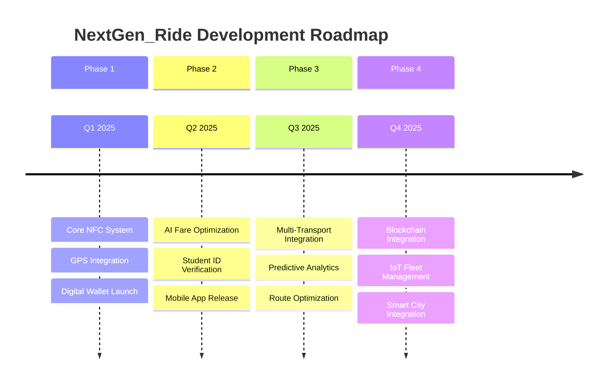

<div align="center">

# 🚍 NextGen_Ride


### 💳 *NFC-based, GPS-powered student fare system with digital wallets & seamless UPI payments*

[](https://nodejs.org/)
[](https://expressjs.com/)
[](https://www.oracle.com/)
[](https://developer.mozilla.org/en-US/docs/Web/JavaScript)


**Making Student Travel Seamless, Smart & Secure! 🎓**

[🚀 Get Started](#-installation--setup) • [✨ Features](#-features) • [🛠️ Tech Stack](#️-technology-stack) • [📱 How It Works](#️-how-it-works)

</div>

---

## 📖 About the Project


**NextGen_Ride** is a revolutionary **NFC-based student fare deduction system** that combines cutting-edge technology to transform public transportation for students. 

By integrating **NFC card readers**, **real-time GPS tracking**, and **digital wallet management**, we've created a seamless transit experience that eliminates manual fare handling and ensures accurate, distance-based pricing.

### 🎯 Mission
To revolutionize student transportation through automated fare collection, making every journey efficient, transparent, and hassle-free.

<br clear="right"/>

---

## 🚨 The Problem

<div align="center">

```ascii
╔══════════════════════════════════════════════════════════════╗
║        ⚠️  CHALLENGES IN STUDENT TRANSPORTATION              ║
╠══════════════════════════════════════════════════════════════╣
║                                                              ║
║  💸  Manual fare collection causing delays                  ║
║  🎫  Lost or damaged physical tickets                       ║
║  📊  Inaccurate fare calculations                           ║
║  ⏰  Time wasted in cash transactions                       ║
║  🔒  No digital payment tracking                            ║
║  📍  No distance-based fair pricing                         ║
║                                                              ║
╚══════════════════════════════════════════════════════════════╝
```

</div>

Traditional bus fare systems rely on manual collection, leading to inefficiencies, fare disputes, and operational delays. Students need a modern, automated solution.

---

## ✅ Our Solution

<div align="center">

</div>

**NextGen_Ride** brings transportation into the digital age with a comprehensive automated fare system:

<table>
<tr>
<td width="50%">

### 🎯 Core Features
- 🔹 **NFC Card Integration**
- 🔹 **Real-Time GPS Tracking**
- 🔹 **Digital Wallet System**
- 🔹 **Automated Fare Calculation**

</td>
<td width="50%">

### 🚀 Key Benefits
- ⚡ **Lightning-Fast Transactions**
- 📊 **Accurate Distance-Based Pricing**
- 💰 **Cashless, Contactless Payments**
- 🎓 **Student-Friendly Interface**

</td>
</tr>
</table>

---

## ✨ Features

<div align="center">

| Feature | Description |
|---------|-------------|
| 💳 **NFC-Based Payment** | Students tap their ID cards when boarding and exiting the bus |
| 📍 **Real-Time GPS Integration** | Calculates fare accurately based on the distance traveled |
| 💰 **Digital Wallet** | Students can top up their wallet, and fares are auto-deducted |
| 🔄 **UPI Integration** | Allows easy top-ups via UPI and other payment gateways |
| 📱 **Mobile App Interface** | Check balance, top-up, and manage transactions seamlessly |
| 🤖 **Automated Fare Collection** | Eliminates manual handling and ensures fair pricing |
| 🚌 **Efficient Operations** | Reduces delays and streamlines public transport |
| 📊 **Transaction History** | Complete visibility of all travel and payment records |

</div>

<div align="center">

</div>

---

## ⚙️ How It Works

<div align="center">



</div>

### 🔄 Step-by-Step Process

<table>
<tr>
<td width="33%" align="center">

### 1️⃣ Tap-In


Students tap their NFC ID card while entering the bus

</td>
<td width="33%" align="center">

### 2️⃣ GPS Tracking


System records boarding location using GPS module

</td>
<td width="33%" align="center">

### 3️⃣ Tap-Out


Students tap their card again on exit

</td>
</tr>
<tr>
<td width="33%" align="center">

### 4️⃣ Fare Calculation


Distance computed via GPS coordinates

</td>
<td width="33%" align="center">

### 5️⃣ Auto-Deduction


Fare automatically deducted from digital wallet

</td>
<td width="33%" align="center">

### 6️⃣ Top-Up


Easy wallet recharge via UPI/payment gateway

</td>
</tr>
</table>

---

## 🏗️ System Architecture



---

## 🛠️ Technology Stack

<div align="center">

### 🌐 Frontend Technologies


**Responsive web interface with intuitive student dashboard**

### ⚙️ Backend Technologies


**RESTful API architecture with real-time processing**

### 💾 Database


**Oracle Database 21c Express Edition for robust data management**

### 🔧 Hardware Components


**NFC Reader for card scanning & GPS Module for location tracking**

### 💳 Payment Integration


**Seamless UPI and payment gateway integration**

</div>

---

## 📂 Project Structure

```
NextGen_Ride/
│
├── 📁 backend/                     # Server-side application
│   ├── 🚀 server.js                # Express server entry point
│   ├── 🔐 .env                     # Environment variables
│   │
│   ├── 📁 config/                  # Configuration files
│   │   └── db.js                   # Oracle DB connection
│   │
│   ├── 📁 models/                  # Database models
│   │   ├── Student.js              # Student schema
│   │   ├── Transaction.js          # Transaction records
│   │   └── Wallet.js               # Wallet management
│   │
│   ├── 📁 routes/                  # API endpoints
│   │   ├── nfc.js                  # NFC tap in/out routes
│   │   ├── wallet.js               # Wallet operations
│   │   └── payment.js              # UPI integration
│   │
│   ├── 📁 controllers/             # Business logic
│   │   ├── fareController.js       # Fare calculation logic
│   │   └── gpsController.js        # GPS processing
│   │
│   └── 📁 middleware/              # Express middleware
│       └── auth.js                 # Authentication
│
├── 📁 frontend/                    # Client-side interface
│   ├── 🏠 index.html               # Landing page
│   ├── 📊 dashboard.html           # Student dashboard
│   ├── 💳 wallet.html              # Wallet management
│   ├── 📜 history.html             # Transaction history
│   │
│   └── 📁 assets/                  # Static resources
│       ├── 🎨 css/
│       │   └── styles.css          # Main stylesheet
│       ├── ⚡ js/
│       │   ├── main.js             # Core JavaScript
│       │   └── wallet.js           # Wallet functions
│       └── 🖼️ images/              # UI assets
│
├── 📁 hardware/                    # Hardware integration
│   ├── nfc_reader.ino              # NFC reader firmware
│   └── gps_module.ino              # GPS module code
│
├── 📁 docs/                        # Documentation
│   ├── API.md                      # API documentation
│   └── SETUP.md                    # Setup guide
│
├── 📦 package.json                 # NPM dependencies
└── 📖 README.md                    # You are here!
```

---

## 🚀 Installation & Setup

<div align="center">

</div>

### Prerequisites

- Node.js (v14.x or higher)
- Oracle Database 21c Express Edition
- NFC Reader Hardware
- GPS Module

### 1️⃣ Clone the Repository

```bash
git clone https://github.com/your-username/next-gen-ride.git
cd next-gen-ride
```

### 2️⃣ Install Dependencies

```bash
npm install
```

### 3️⃣ Configure Database

Edit `db.js` with your Oracle Database credentials:

```javascript
module.exports = {
  user: "your_username",
  password: "your_password",
  connectString: "localhost:1521/XE"
};
```

### 4️⃣ Setup Environment Variables

Create a `.env` file in the root directory:

```env
PORT=3000
DB_USER=your_db_username
DB_PASSWORD=your_db_password
DB_CONNECTION_STRING=localhost:1521/XE
UPI_API_KEY=your_upi_api_key
GPS_API_KEY=your_gps_api_key
```

### 5️⃣ Start the Server

```bash
# Production mode
node server.js

# Development mode with auto-reload
nodemon server.js
```

### 6️⃣ Access the Application

Open your browser and navigate to:

```
http://localhost:3000
```

<div align="center">

**🎉 NextGen_Ride is now running!**

</div>

---

## 📱 Screenshots

<div align="center">

### 🌐 Web Interface


*Modern, intuitive student dashboard with real-time wallet balance and transaction history*

---

### ⚙️ Node.js Server Response


*Backend server processing NFC transactions and GPS data in real-time*

---

### 💾 Database Management


*Oracle Database 21c handling student records, transactions, and wallet balances*

</div>

---

## 🔮 Future Enhancements

<div align="center">



</div>

### 🎯 Planned Features

- 🤖 **AI-Based Fare Optimization** - Machine learning for dynamic pricing based on demand
- 🎓 **Student ID Verification System** - Integration with institutional databases
- 📱 **Native Mobile Apps** - iOS and Android applications with offline capability
- 🚍 **Multi-Transport Support** - Extend to trains, metros, and shared vehicles
- 🌐 **Smart City Integration** - Connect with broader urban mobility solutions
- 📊 **Advanced Analytics Dashboard** - Insights for transport authorities
- ⛓️ **Blockchain Transaction Ledger** - Enhanced security and transparency
- 🔔 **Smart Notifications** - Real-time alerts for low balance, promotions
- 🗺️ **Route Planning** - Suggest optimal routes and schedules

---

## 💡 Use Cases

<table>
<tr>
<td width="50%">

### 👨‍🎓 For Students
- ✅ Contactless, cashless payments
- ✅ Accurate distance-based fares
- ✅ Digital transaction history
- ✅ Easy wallet top-ups via UPI
- ✅ No more lost or damaged tickets

</td>
<td width="50%">

### 🚌 For Transport Operators
- ✅ Automated fare collection
- ✅ Reduced operational delays
- ✅ Real-time revenue tracking
- ✅ Eliminate cash handling
- ✅ Better route planning data

</td>
</tr>
<tr>
<td width="50%">

### 🏫 For Institutions
- ✅ Track student attendance
- ✅ Ensure student safety
- ✅ Manage transport subsidies
- ✅ Generate usage reports
- ✅ Integrated ID card system

</td>
<td width="50%">

### 🏛️ For Authorities
- ✅ Transparent fare system
- ✅ Usage analytics and insights
- ✅ Efficient resource allocation
- ✅ Environmental benefits
- ✅ Data-driven policy making

</td>
</tr>
</table>

---

## 🎓 How to Use

<div align="center">

### For Students


</div>

1. **Register** - Link your student ID with the NextGen_Ride system
2. **Top-Up** - Add money to your digital wallet using UPI
3. **Tap-In** - Scan your NFC card when boarding the bus
4. **Travel** - Enjoy your journey worry-free
5. **Tap-Out** - Scan again when exiting
6. **Relax** - Fare is automatically calculated and deducted

---

## 🤝 Contributors

<div align="center">


### 👨‍💻 Development Team

**Siddharth Goutam Kumar**  
*Lead Developer & Project Architect*


</div>

---

## 📧 Contact & Support

<div align="center">

### 📬 Get in Touch

[](mailto:kumarsiddharth166@gmail.com)
[](https://github.com)
[](https://linkedin.com)

**📮 Email:** kumarsiddharth166@gmail.com

For any queries, feature requests, or bug reports, please reach out via email or open an issue on GitHub!

</div>

---

## 🌟 Show Your Support

<div align="center">

If you find **NextGen_Ride** useful and innovative, please consider giving it a ⭐!

[](https://github.com/your-username/next-gen-ride/stargazers)
[](https://github.com/your-username/next-gen-ride/network/members)
[](https://github.com/your-username/next-gen-ride/issues)

---


### 💡 NextGen_Ride: Making Student Travel Seamless, Smart & Secure!

**© 2025 NextGen_Ride | Revolutionizing Student Transportation**


</div>
